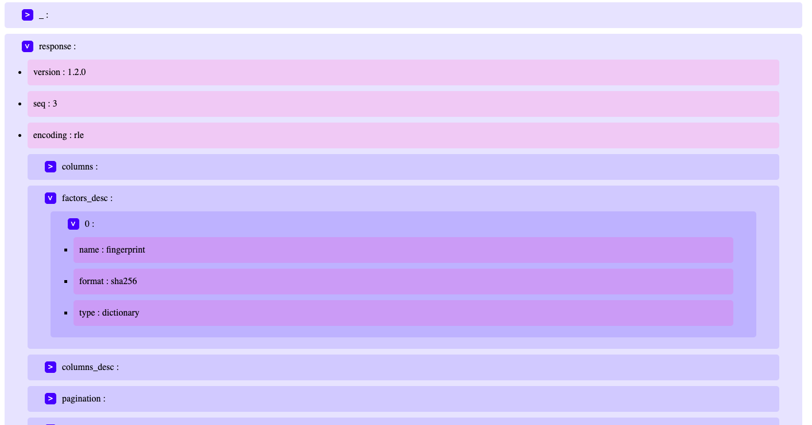

<div id="top"></div>
    <p align="center">
        
    </p>
    <h2 align="center">JSON Challenge</h2>
    <br />
    <p align="center">
        Creating a JSON viewer using React and nested HTML elements!
        <br />
        <br />
        <a href="https://gt1990.github.io/json_challenge/">View Live Demo</a>
    </p>
</div>

<!-- TABLE OF CONTENTS -->

// TODO: write table of contents here

## About The Project



### Objective

<p>
The objective of this challenge was to import a JSON file and create a JSON viewer using React. The JSON viewer traverses through the JSON object and displays the data in nested HTML elements.
</p>

### Project Summary

<div>

<h4>Something I Learned During This Project</h4>
<p>
What I found intriguing about react was the ability to break up my code into smaller components. I found this to be a cleaner and more organized method to write code.
<br />
During this project I found myself writing duplicated code at first. I was using the same function twice to update local state on a click event. What I learned was that I could simply place that function in its own file, pass it the props, such as a reference to the setter method of the useState hook, and exported where ever I found myself needing it.
</p>

<h4>Something I Learned Recently</h4>
<p>
I learned recently that Arrays are a special type of object in JavaScript. Knowing this helped me in this project when I was traversing through the JSON object. If the next node I was looking at had a typeof 'object' then I knew there was nested data. Otherwise that next node would not have nested data and end up being a string or number.
</p>

<h4>Something I Found Challenging</h4>
<p>
Traversing through the json object wasn't too difficult. What I found challenging was now using that data by creating nested html elements. Appending child nodes to their parent elements using html element is easier, in my opinion, than working with react elements. I could have just used the .appendChild method to nest child nodes.
<br />
My solution to this problem was recursively nesting the child components and passing down the data through props. To break out of the recursion calls I used the point I mentioned above to check if I found the end node with no more nested data.
</p>
</div>

<p align="right">(<a href="#top">back to top</a>)</p>

### Built With

The project was created using create-react-app.

- [React.js](https://reactjs.org/)

<p align="right">(<a href="#top">back to top</a>)</p>

## Getting Started

1. Download or Clone project files
2. Install project dependencies

   ```sh
      npm install
   ```

3. Run project on localhost:3000

   ```sh
      npm run start
   ```
